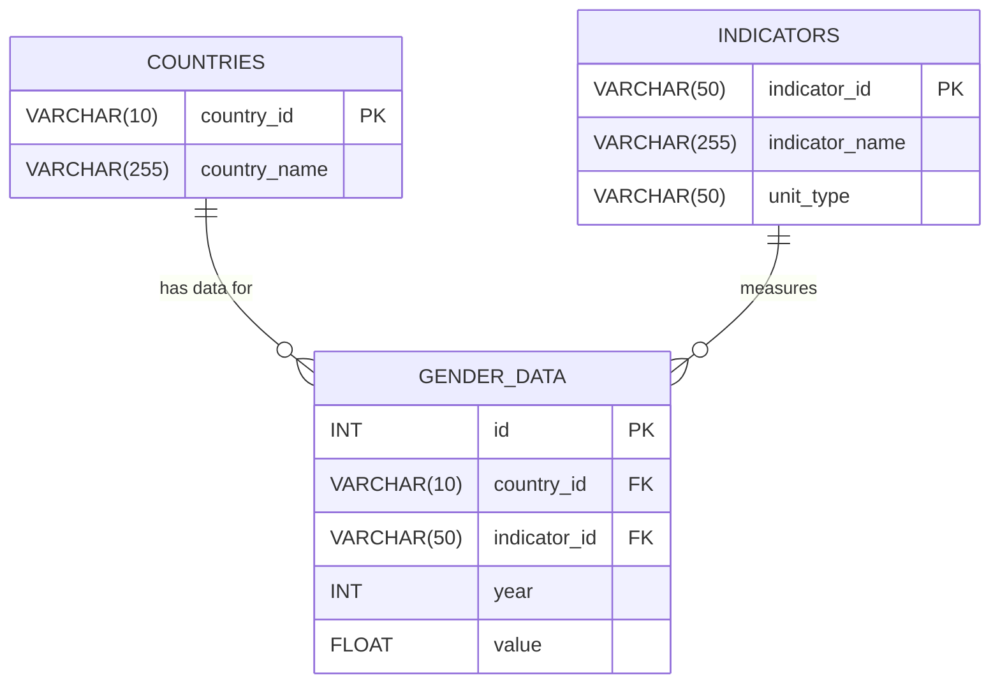

# 🌐 MENA Gender Data Dashboard 
#### End-to-End Data Pipeline Overview

## ⦿ Project Purpose
The MENA Gender Data Dashboard is a data-driven platform that tracks gender-related development indicators across 13 Middle East and North Africa countries.
It integrates automated data collection, cleaning, statistical analysis, machine learning, and visualisation into a single reproducible pipeline.
The goal is to transform fragmented World Bank Gender Statistics into clear, actionable insights for researchers and policy analysts.


## ⦿ High-Level Architecture


## ⦿ Pipeline Summary by Phase


| Phase                                 | Description                                                                                                | Key Tools / Outputs                                              |
| ------------------------------------- | ---------------------------------------------------------------------------------------------------------- | ---------------------------------------------------------------- |
| **1 – API Fetching & Pre-processing** | Retrieve 45 gender, education, and economic indicators for 13 MENA countries (2000–2024). Add unit types.  | `Python · requests · pandas` → `data/all_countries_selected.csv` |
| **2 – Data Cleaning & Validation**    | Remove duplicates, handle nulls, apply contextual fills, flag structural missing years.                    | Cleaned CSV (< 10 % nulls)                                       |
| **3 – SQL Integration**               | Import clean dataset into MySQL schema; normalize and create views for queries.                 | `SQL DDL/DML scripts · ERD`                                      |
| **4 – Analytics & ML Models**         | Clustering (K-Means), Anomaly Detection, Classification (Random Forest/SVM), Explainability (SHAP).        | `MLflow · scikit-learn · Pandas`                                 |
| **5 – Visualization & Insights**      | Interactive dashboard with time-series and geospatial visuals; gender-gap heatmaps and policy annotations. | `Tableau · Python plots`                              |


## ⦿ Key Deliverables

- Automated Data Fetcher: 13-country pipeline with retry logic and pagination

- Clean Unified Dataset: 2000–2023 data across 45 indicators

- SQL Schema + Queries: reusable relational model for analysis

- Machine Learning Modules: clustering + risk prediction

- Interactive Dashboard: gender gap visuals and policy context

_________________


# ♦︎ Phase 1 – API Fetching & Data Cleaning (Python)

## 🌐  Countries Covered

Egypt, Morocco, Saudi Arabia, Jordan, Tunisia, Iraq, Yemen, Oman, Qatar, Bahrain, Kuwait, Algeria, Libya

## 📊  Indicators

45+ gender, economic, and social indicators (e.g., literacy rates, employment, WBL Index, life expectancy, etc.).
Each indicator includes metadata such as Indicator Code, Indicator Name, Country, Year, and Value.


## ⦿ Step 1: API Fetching (src/api_fetcher.py)
#### Purpose
Automates fetching of World Bank data and exports a unified dataset for all selected indicators and countries.

#### Main Features

- Uses requests with robust retry logic for API stability.

- Handles pagination to fetch all pages per indicator.

- Fetches all 13 countries simultaneously for speed.

- Saves:
  - IND_<indicator>.csv – per-indicator raw exports
  - <country>_selected.csv – per-country filtered exports
  - all_countries_selected.csv – combined dataset for cleaning

- Automatically applies unit type inference using src/unit_types.py.

#### Output Example  

```bash
data/
├── IND_SG.LAW.INDX.csv
├── EGY_selected.csv
├── all_countries_selected.csv
logs/
└── fetch.log
```

## ⦿ Step 2: Unit Type Inference (src/unit_types.py)
#### Purpose
Adds a clean, standardized unit_type label to every indicator.

#### Logic
Uses rule-based text detection to classify units such as:

- Percent (%)

- Index / Score

- Binary (1=yes; 0=no)

- Currency (US$)

- Rate per 1,000 or 100,000

- Ratio or Parity (GPI)

- Count / Population

#### Example
| Indicator Name                         | Unit Type      |
| -------------------------------------- | -------------- |
| Women Business and the Law Index Score | Index / Score  |
| Labor force participation rate, female | Percent (%)    |
| Birth rate, crude (per 1,000 people)   | Rate per 1,000 |


## ⦿ Step 3: Data Cleaning & Validation (notebooks/dataCleaning.ipynb)
#### Purpose

Ensure completeness, accuracy, and readiness of fetched data for analysis.

#### Tools Used
- Pandas for data cleaning
- Numpy for numeric transformations
- Matplotlib and Seaborn for missing value diagnostics

#### Main Cleaning Steps
1. Detect and remove structurally empty indicators.

2. Diagnose missingness patterns (by year, country, and indicator).

3. Apply contextual filling:

  - Forward-fill (minor temporal gaps)

  - Back-fill (short reverse gaps)

  - Interpolation (smooth numeric trends)

4. Drop years or indicators with persistent missing data (e.g., 2024)

5. Preserve structural nulls (e.g., literacy gaps due to missing census years).

#### Result

- Data reduced to <10% nulls, mostly from literacy and educational attainment indicators.

- Clean, analysis-ready CSV with a new unit_type column.


## ⦿ Final Output (End of Python Phase)
- data/all_countries_selected.csv → Master dataset (ready for SQL import).

Columns:

```bash
Country | Country Code | Year | Indicator Code | Indicator Name | Value | Unit Type | missing_rate
```

# ♦︎ Phase 2 – SQL Phase: Database Normalization

## ⦿ SQL Database Schema



# ♦︎ Phase 3 - Pre Tableau Prep 

## ⦿ Indicator Categorization Framework
To support clearer analysis, SQL joins, and Tableau filtering, all 45 indicators were grouped into 8 thematic categories.
This improves dashboard clarity, storytelling, and data modeling.

| **Category Code** | **Category Name**                 | **Description**                                                   | **Examples of Indicators**                                  |
| ----------------- | --------------------------------- | ----------------------------------------------------------------- | ----------------------------------------------------------- |
| **C1**            | Gender Rights & Legal Empowerment | Measures women’s legal autonomy, protections, and civil rights.   | “A woman can…” rights, sexual harassment laws               |
| **C2**            | Political Representation          | Women’s participation in leadership and national decision-making. | Women in parliament, ministerial positions                  |
| **C3**            | Demographic & Life Expectancy     | Core demographic trends and population health.                    | Birth rate, adolescent fertility, life expectancy           |
| **C4**            | Health & Mortality                | Gender-related health outcomes and vulnerabilities.               | Maternal mortality, male/female HIV prevalence              |
| **C5**            | Education & Literacy              | Educational attainment, literacy, parity in schooling.            | Literacy rates, secondary GPI, upper secondary completion   |
| **C6**            | Labor Force & Employment          | Women’s and men’s participation in economic activity.             | Labor force rate, unemployment rate, employment in services |
| **C7**            | Economic Conditions               | Macro-economic indicators shaping gender outcomes.                | GDP per capita, inflation                                   |
| **C8**            | Composite Gender Index            | Multi-dimensional gender equality scoring.                        | Women, Business & the Law Index                             |


## ⦿ Regional Grouping
Before connecting the cleaned dataset to Tableau, a regional grouping was created to organize MENA countries into meaningful subregions.
This grouping enables more coherent regional comparisons and visual storytelling within the dashboard.

| **Country**      | **Assigned Region**            | 
| ---------------- | ------------------------------ |
| Bahrain          | GCC (Gulf Cooperation Council) |
| Kuwait           | GCC                            |                                                                    
| Oman             | GCC                            |                                                                    
| Qatar            | GCC                            |                                                                    
| Saudi Arabia     | GCC                            |                                                                    
| Egypt, Arab Rep. | North Africa                   |                                                                    
| Libya            | North Africa                   |                                                                    
| Tunisia          | North Africa                   |                                                                    
| Algeria          | North Africa                   |                                                                    
| Morocco          | North Africa                   |                                                                    
| Jordan           | Levant                         |                                                                    
| Iraq             | Other                          | 
| Yemen, Rep.      | Other                          |


###### Note:
Iraq and Yemen were classified as “Other” because they do not fully align with the political or geographic boundaries of the GCC, Levant, or North African subregions.


