# 🌐 MENA Gender Data Dashboard 
#### End-to-End Data Pipeline Overview

## ⦿ Project Purpose
The MENA Gender Data Dashboard is a data-driven platform that tracks gender-related development indicators across 13 Middle East and North Africa countries.
It integrates automated data collection, cleaning, statistical analysis, machine learning, and visualisation into a single reproducible pipeline.
The goal is to transform fragmented World Bank Gender Statistics into clear, actionable insights for researchers and policy analysts.


## ⦿ High-Level Architecture

```mermaid
flowchart LR
    %% Direction: Left → Right
    %% --- GLOBAL STYLING ---
    classDef phase fill:#222833,stroke:#999,stroke-width:2px,color:#ffffff,font-size:20px,font-weight:bold,padding:15px;
    classDef sub fill:#2c2f38,stroke:#777,stroke-width:1px,color:#f0f0f0,font-size:16px,font-weight:500,padding:10px;
    classDef flow stroke:#aaa,stroke-width:1px;

    %% --- MAIN PHASES ---
    A([Phase 1: Data Ingestion]):::phase
    B([Phase 2: Data Cleaning & Validation]):::phase
    C([Phase 3: SQL Integration]):::phase
    D([Phase 4: Analytics & ML]):::phase
    E([Phase 5: Visualization & Insights]):::phase

    %% --- PIPELINE FLOW ---
    A -->|Collect & Standardize| B
    B -->|Validate & Prepare| C
    C -->|Integrate Schema| D
    D -->|Model & Explain| E

    %% --- SUBPHASES ---
    subgraph A1[ ]
        direction TB
        A1a[World Bank API Fetcher]:::sub
        A1b[Unit Type Inference]:::sub
    end

    subgraph B1[ ]
        direction TB
        B1a[Duplicates & Null Handling]:::sub
        B1b[Contextual Filling Rules]:::sub
        B1c[Structural Gap Flagging]:::sub
    end

    subgraph C1[ ]
        direction TB
        C1a[Schema Design & Keys]:::sub
        C1b[Country & Indicator Joins]:::sub
        C1c[Stored Views for Queries]:::sub
    end

    subgraph D1[ ]
        direction TB
        D1a[Clustering & Anomaly Detection]:::sub
        D1b[Classification of High-Risk Countries]:::sub
        D1c[Explainable AI – SHAP + LIME]:::sub
    end

    subgraph E1[ ]
        direction TB
        E1a[Tableau Interactive Dashboard]:::sub
        E1b[Policy Insight Narratives]:::sub
    end

    %% --- ALIGN SUBGRAPHS ---
    A1 --- B1 --- C1 --- D1 --- E1


```


## ⦿ Pipeline Summary by Phase


| Phase                                 | Description                                                                                                | Key Tools / Outputs                                              |
| ------------------------------------- | ---------------------------------------------------------------------------------------------------------- | ---------------------------------------------------------------- |
| **1 – API Fetching & Pre-processing** | Retrieve 45 gender, education, and economic indicators for 13 MENA countries (2000–2024). Add unit types.  | `Python · requests · pandas` → `data/all_countries_selected.csv` |
| **2 – Data Cleaning & Validation**    | Remove duplicates, handle nulls, apply contextual fills, flag structural missing years.                    | Cleaned CSV (< 10 % nulls)                                       |
| **3 – SQL Integration**               | Import clean dataset into MySQL schema; normalize and create views for queries.                 | `SQL DDL/DML scripts · ERD`                                      |
| **4 – Analytics & ML Models**         | Clustering (K-Means), Anomaly Detection, Classification (Random Forest/SVM), Explainability (SHAP).        | `MLflow · scikit-learn · Pandas`                                 |
| **5 – Visualization & Insights**      | Interactive dashboard with time-series and geospatial visuals; gender-gap heatmaps and policy annotations. | `Tableau · Python plots`                              |


## ⦿ Key Deliverables

- Automated Data Fetcher: 13-country pipeline with retry logic and pagination

- Clean Unified Dataset: 2000–2023 data across 45 indicators

- SQL Schema + Queries: reusable relational model for analysis

- Machine Learning Modules: clustering + risk prediction

- Interactive Dashboard: gender gap visuals and policy context

_________________


# ♦︎ Phase 1 – API Fetching & Data Cleaning (Python)


This phase covers the automated extraction, refinement, and preprocessing of gender, education, demographic, and economic indicators from the World Bank API and supplementary UNESCO data. As the analytical direction of the project became clearer, the indicator list, country coverage, and data scope were expanded to support a richer and more complete narrative across the MENA region.

## Indicator Refinement and Expansion

Several indicators originally included were removed due to limited analytical value or static, non-informative values. Examples include HIV prevalence indicators and certain labor-force metrics that showed little to no variation across countries and years. In their place, more relevant and story-aligned indicators were added, including:

• Full Women, Business & the Law (WBL) component indices
• Human Capital Index (HCI) indicators
• Gini coefficient
• Population and demographic measures
• Employment-to-population ratios (replacing weaker labor-force metrics)

Country coverage was expanded from 13 to 18 countries to fully represent the MENA region. All new indicators and countries were incorporated into the API-fetching module, and an updated master dataset was generated reflecting this expanded scope.

## 🌐 Countries Covered

Algeria, Bahrain, Egypt, Iraq, Jordan, Kuwait, Lebanon, Libya, Morocco, Oman, Qatar, Saudi Arabia, Syria, Tunisia, United Arab Emirates, Yemen, Palestine, Iran


## 📊 Indicators

The dataset now includes 45+ gender, social, economic, legal, and demographic indicators such as literacy rates, WBL Index scores, HCI components, Gini inequality measures, employment ratios, and life expectancy. All indicators include standardised metadata fields: Indicator Code, Indicator Name, Country, Year, and Value.


## ⦿ Step 1: API Fetching (src/api_fetcher.py)
#### Purpose
Automates the fetching of World Bank data and exports a unified dataset for all selected indicators and countries.

#### Main Features

- Uses requests with robust retry logic for API stability.

- Handles pagination to fetch all pages per indicator.

- Fetches all 13 countries simultaneously for speed.

- Saves:
  - IND_<indicator>.csv – per-indicator raw exports
  - <country>_selected.csv – per-country filtered exports
  - all_countries_selected.csv – combined dataset for cleaning

- Automatically applies unit type inference using src/unit_types.py.

#### Output Example  

```bash
data/
├── IND_SG.LAW.INDX.csv
├── EGY_selected.csv
├── all_countries_selected.csv
logs/
└── fetch.log
```

## ⦿ Step 2: Unit Type Inference (src/unit_types.py)
#### Purpose
Adds a clean, standardized unit_type label to every indicator.

#### Logic
Uses rule-based text detection to classify units such as:

- Percent (%)

- Index / Score

- Binary (1=yes; 0=no)

- Currency (US$)

- Rate per 1,000 or 100,000

- Ratio or Parity (GPI)

- Count / Population

#### Example
| Indicator Name                         | Unit Type      |
| -------------------------------------- | -------------- |
| Women Business and the Law Index Score | Index / Score  |
| Labor force participation rate, female | Percent (%)    |
| Birth rate, crude (per 1,000 people)   | Rate per 1,000 |


# ♦︎ Phase 2 –  External Data Integration (UNESCO Education & Literacy Data)

## Purpose

To compensate for the high missingness in World Bank education and literacy indicators, an additional dataset from the UNESCO Institute for Statistics was integrated into the project. The goal was to enrich the literacy and schooling dimension of the dashboard and ensure more complete time-series coverage across the full MENA region.

## Data Source

UNESCO Institute for Statistics (UIS)
Downloaded as: UNESCO.csv

## Scope of UNESCO Indicators

The imported dataset includes key education and literacy metrics such as:
- Educational attainment rate, completed upper secondary education or higher, population 25+ years, female (%)
- Educational attainment rate, completed upper secondary education or higher, population 25+ years, male (%)
- Youth literacy rate, population 15-24 years, female (%)
- Youth literacy rate, population 15-24 years, male (%)
- Literacy rate, population 25-64 years, female (%)
- Literacy rate, population 25-64 years, male (%)

These metrics complement and extend the World Bank’s Education & Literacy category by filling structural gaps in the region.

## Processing Steps (Technical)

### Raw CSV Acquisition and Manual Pre-Filtering

The full dataset was downloaded directly from the UNESCO online portal.

Using Excel, the raw CSV was manually cleaned to retain only relevant fields:
year, indicator_id, indicator_name, country_id, country_name, value

Indicators were mapped to their codes using VLOOKUP to ensure consistency with project metadata conventions.

Country names were normalized manually to match the World Bank naming scheme (e.g., “Egypt” → “Egypt, Arab Rep.”).

### Notebook Import and Standardization (notebooks/data_merge.ipynb)
Two dataframes were created for each dataset. Both were brought into a unified environment to ensure structural alignment. To ensure clean merging with no issues, both datasets were standardised. In addition, the UNESCO indicators were passed through the unit type inference system. This allowed UNESCO indicators to be seamlessly integrated into downstream EDA, modeling, and Tableau visualization.

### Data Merge Into Unified Long-Format Dataset

The two datasets were concatenated into a single long-format dataframe:
combined = pd.concat([wb, unesco], ignore_index=True)

This merged dataset now contains:
• Updated World Bank indicators (expanded to 18 MENA countries)
• Supplementary UNESCO education/literacy indicators
• Harmonized country names
• Consistent indicator IDs and unit types

The final merged output was saved as:
data/merged_data.csv

This file now serves as the new master input for the Phase 3 cleaning workflow.


# ♦︎ Phase 3: Data Cleaning & Validation

#### Location: notebooks/cleaning.ipynb

#### Output files:
- ml_df.csv → cleaned + interpolated dataset for ML
- final_df_for_tableau.csv → cleaned + enriched + raw-kept dataset for Tableau storytelling

#### Purpose

The goal of Phase 3 was to transform the raw merged dataset into two things:

1. A clean, analysis-ready dataset for ML modeling (minimal missingness).

2. A comprehensive Tableau dataset that preserves even structurally missing values to visualize real-world data gaps in gender & education indicators across the MENA region.

This phase focused heavily on handling complex missingness patterns arising from two different sources (World Bank + UNESCO).


#### Step-by-Step Cleaning Workflow
##### 1. Fix and Standardize Raw Fields.
   
✔ Converted value column to numeric using:
```bash
    df["value"] = pd.to_numeric(df["value"], errors="coerce")
```

✔ Confirmed expected columns:

```bash
country_name | year | indicator_id | indicator_name | value | unit_type | source | source_reliable
```

##### 2.Identify Completely Empty Indicators (Structural Missingness)

##### 3. Deep-dive into Education (UNESCO + WHO) Data to Assess Coverage.

Since education & literacy were known to be sparse:
a) Created a source flag (WHO vs UNESCO)

Checked which indicators came from which source:

```bash
    df['source_reliable'] = df['indicator_name'].apply(
    lambda x: "low" if indicator_class[x] == "low missingness" else "high"
)
```

b) Computed coverage for each source separately

- who_only

- unesco_only

- both_sources (none found)

- none_sources (3715 rows with missing from both)

Then:

```bash
who_coverage = who_only["value"].isna().mean()
unesco_coverage = unesco_only["value"].isna().mean()
```

Result:

- WHO avg missingness ≈ 17%

- UNESCO avg missingness ≈ 14% (but extremely patchy by country)

c) Country-level coverage patterns (major insight)

| Country          | % Missing |
| ---------------- | --------- |
| Libya            | **100%**  |
| Yemen            | 92%       |
| Saudi Arabia     | 100%      |
| UAE              | 92%       |
| Bahrain          | 81%       |
| Egypt            | 68%       |
| Morocco          | 88%       |
| Tunisia          | 50%       |
| Iran             | 36%       |
| West Bank & Gaza | 18%       |

➡ Conclusion:
Education data is severely limited, especially for GCC + conflict-affected countries.
➡ Therefore: UNESCO / WHO education indicators cannot be used for ML but are extremely valuable for the dashboard narrative (data deserts).


##### 4. Classify Missingness Into 4 Categories:

```bash
def classify(m):
    if m > 0.75: 
        return "severely incomplete"
    elif m > 0.45:
        return "high missingness"
    elif m > 0.20:
        return "moderate missingness"
    else:
        return "low missingness"
```

Example indicator missingness:
| Indicator                                   | Missing % | Category                |
| ------------------------------------------- | --------- | ----------------------- |
| Contraceptive prevalence (modern)           | 0.87      | **Severely incomplete** |
| Gini Index                                  | 0.86      | **Severely incomplete** |
| School enrollment GPI                       | 0.45–0.60 | High/moderate           |
| HCI (all versions)                          | 0.38–0.70 | Moderate/High           |
| Fertility, Life expectancy, Employment, GDP | <5%       | Low                     |


##### 5. Rule-Based Missing Value Treatment (Your Final Framework)

| **Missingness Class**   | **% Null** | **Rule Applied**              | **Why**                                               |
| ----------------------- | ---------- | ----------------------------- | ----------------------------------------------------- |
| **Low**                 | <20%       | `interpolate_full`            | Smooth, stable indicators → safe to interpolate fully |
| **Moderate**            | 20–45%     | `interpolate_safe` (limit=3)  | Fill short gaps only                                  |
| **High**                | 45–75%     | `interpolate_short` (limit=1) | Avoid overfitting trends                              |
| **Severely Incomplete** | >75%       | **keep_raw**                  | Too sparse → used only to visualize data gaps         |


##### 6. Apply Cleaning Rules Per Indicator × Country

```bash
for ind, group in tqdm(clean_df.groupby("indicator_name")):
    rule = CLEANING_RULES.get(indicator_class[ind], "keep_raw")
    cleaned = (
        group[["country_name","year","value"]]
        .sort_values("year")
        .groupby("country_name", group_keys=False)
        .apply(CLEANING_FUNCS[rule])
        .reset_index(drop=True)
    )

    cleaned_full = cleaned.merge(
        group.drop(columns=["value"]),
        on=["country_name","year"],
        how="left"
    )
```


##### 7.Removed year 2024 (structurally too incomplete)

##### Final Deliverables:

A. ML-Ready Dataset (ml_df)

✔ Missing values reduced to 282
✔ Fully cleaned + interpolated
✔ Ready for feature engineering + ML modeling (clustering, classification, PCA, SHAP)

B. Tableau Dataset (final_df_for_tableau)

Merged cleaned WB + cleaned UNESCO + raw UNESCO (for missingness transparency)

This dataset:

- Keeps all indicators, even those with 100% missing

- Includes a source and source_reliable tag

- Preserves missingness for your data desert story

- Perfect for Tableau visuals


# ♦︎ Phase 4 - Pre Tableau Prep 

## ⦿ Indicator Categorization Framework
To support clearer analysis, SQL joins, and Tableau filtering, all 45 indicators were grouped into 8 thematic categories.
This improves dashboard clarity, storytelling, and data modeling.

| **Category Code** | **Category Name**                 | **Description**                                                   | **Examples of Indicators**                                  |
| ----------------- | --------------------------------- | ----------------------------------------------------------------- | ----------------------------------------------------------- |
| **C1**            | Gender Rights & Legal Empowerment | Measures women’s legal autonomy, protections, and civil rights.   | “A woman can…” rights, sexual harassment laws               |
| **C2**            | Political Representation          | Women’s participation in leadership and national decision-making. | Women in parliament, ministerial positions                  |
| **C3**            | Demographic & Life Expectancy     | Core demographic trends and population health.                    | Birth rate, adolescent fertility, life expectancy           |
| **C4**            | Health & Mortality                | Gender-related health outcomes and vulnerabilities.               | Maternal mortality, male/female HIV prevalence              |
| **C5**            | Education & Literacy              | Educational attainment, literacy, parity in schooling.            | Literacy rates, secondary GPI, upper secondary completion   |
| **C6**            | Labor Force & Employment          | Women’s and men’s participation in economic activity.             | Labor force rate, unemployment rate, employment in services |
| **C7**            | Economic Conditions               | Macro-economic indicators shaping gender outcomes.                | GDP per capita, inflation                                   |
| **C8**            | Composite Gender Index            | Multi-dimensional gender equality scoring.                        | Women, Business & the Law Index                             |


## ⦿ Regional Grouping
Before connecting the cleaned dataset to Tableau, a regional grouping was created to organize MENA countries into meaningful subregions.
This grouping enables more coherent regional comparisons and visual storytelling within the dashboard.

| **Country**      | **Assigned Region**            | 
| ---------------- | ------------------------------ |
| Bahrain          | GCC (Gulf Cooperation Council) |
| Kuwait           | GCC                            |                                                                    
| Oman             | GCC                            |                                                                    
| Qatar            | GCC                            |                                                                    
| Saudi Arabia     | GCC                            |                                                                    
| Egypt, Arab Rep. | North Africa                   |                                                                    
| Libya            | North Africa                   |                                                                    
| Tunisia          | North Africa                   |                                                                    
| Algeria          | North Africa                   |                                                                    
| Morocco          | North Africa                   |                                                                    
| Jordan           | Levant                         |                                                                    
| Iraq             | Other                          | 
| Yemen, Rep.      | Other                          |


###### Note:
Iraq and Yemen were classified as “Other” because they do not fully align with the political or geographic boundaries of the GCC, Levant, or North African subregions.


